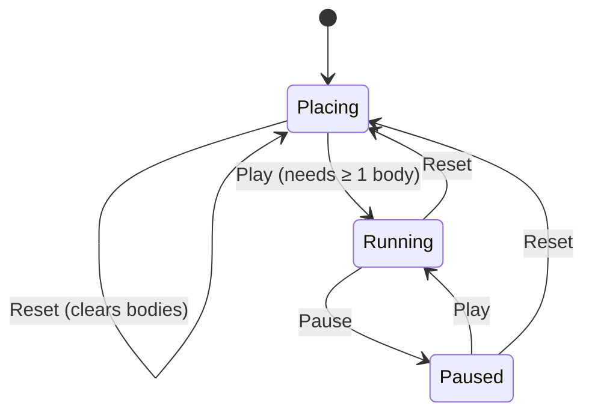
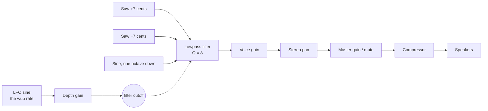

# Helios — Three-Body Visualizer Design

_As of 2026-09-25_

## Overview and goals

Helios is a single web page. The user clicks to place bodies, presses **Play** to run a gravity simulation, and presses **Reset** to start over. Phase 1 focuses on visuals. Each body is a pulsing colored sphere that also emits a sci-fi "wub wub wub" drone. Its size, shape, pulse and wub rate change as it gets close to other bodies.

- **Place bodies:** each click on the canvas creates one body at that point.
- **Show interaction:** a body's appearance and sound change as it nears another body, both before and during the simulation.
- **Keep controls simple:** Play, Reset, Info and a Mute checkbox.
- **Explain the science:** an Info pop-up describes the three-body problem, why it has no general solution, and why it is unstable.
- **Run in any modern browser:** no install and no server. Target 60 fps with up to about 10 bodies.

Not in phase 1: saving or sharing scenarios, preset orbits, 3D camera control.

## User experience

The page is a full-window dark canvas with a small control bar at the bottom center: **Play/Pause**, **Reset**, **Info** and a **Mute** checkbox.

### States



| State   | Canvas click          | Play button       | Reset button                     |
| ------- | --------------------- | ----------------- | -------------------------------- |
| Placing | Adds a body           | Starts simulation | Clears all bodies                |
| Running | Ignored (phase 1)     | Shows **Pause**   | Stops, clears bodies, → Placing  |
| Paused  | Ignored (phase 1)     | Resumes           | Stops, clears bodies, → Placing  |

### Details

- **Placing a body:** the body appears at the cursor with a short "birth" animation (it grows from 0 to full size over about 300 ms). Bodies start at rest in phase 1.
- **Colors:** each new body gets the next color from a fixed palette of distinct hues (for example amber, cyan, magenta, lime, violet), so bodies are easy to tell apart.
- **Pulsing starts right away.** Bodies pulse and react to each other's proximity while the user is still placing them. This makes the page feel alive before Play is pressed.
- **Play disabled** until at least one body exists (two or more are needed for anything interesting).
- **Reset** returns to an empty canvas. An open question is whether Reset should instead restore the bodies to where they were placed (see Open questions).
- **Trails (optional in phase 1):** a fading trail behind each body while it moves.
- **Info:** opens a modal dialog (native `<dialog>`) explaining the three-body problem: what it is, why it is hard to solve (18 variables, only 10 conservation laws; Bruns and Poincaré showed no general closed form exists; Sundman's series converges too slowly to use), why it is unstable (chaos, close-encounter energy exchange, eventual ejection), the rare periodic solutions (Euler, Lagrange, figure-eight), and how this simulation differs (2D, softened, central pull). It closes with the × button, Esc, or a click on the backdrop. The simulation keeps running behind it.
- **Mute:** a checkbox that silences all sound in every state. It fades out over about 50 ms rather than cutting off, and the choice is remembered in the browser (`localStorage`).

## Visual design

Each body is a glowing sphere drawn as a radial gradient: a bright core, its hue, and a soft outer glow that fades to transparent. Three properties respond to the distance to the **nearest other body**.

Proximity factor, from 0 (far away) to 1 (touching):

```
p = clamp(1 - (d - r_contact) / (r_influence - r_contact), 0, 1)
```

- `d` = distance to the nearest other body (px)
- `r_contact` = sum of the two radii
- `r_influence` = distance where effects begin (start with 250 px)

| Property | Far (p = 0)                          | Close (p → 1)                                                                                  |
| -------- | ------------------------------------ | ---------------------------------------------------------------------------------------------- |
| Size     | Base radius (for example 18 px)      | Grows up to about 1.6× base, and the glow halo widens                                          |
| Shape    | Circle                               | Stretches toward the neighbor (tidal ellipse) up to about 1.5:1, with its long axis on the line between them |
| Pulse    | Slow and gentle: ~0.5 Hz, ±5% radius | Fast and strong: ~3 Hz, ±20% radius, brighter core                                             |
| Color    | Base hue                             | Shifts toward white-hot at the core; optional blend toward the neighbor's hue in the overlapping glow |

Notes:

- **Smoothing:** ease `p` over time (for example exponential smoothing with ~150 ms time constant) so the effects don't jitter when a close approach is fast.
- **Pulse phase:** give each body a random phase offset so they don't pulse in lockstep. Adjust the phase as frequency changes so the pulse speeds up without jumping.
- **Multiple neighbors:** phase 1 uses only the nearest body. A later option: sum the tidal stretch from every neighbor, weighted by 1/d².
- **Blending:** draw glows with additive blending (`globalCompositeOperation = "lighter"`) so overlapping glows brighten naturally.

## Sound design

Every body emits its own looping sci-fi **wub**: a low drone whose tone opens and closes rhythmically. The closer the body is to another body, the faster, brighter and louder it wubs. Sound uses the same smoothed proximity factor `p` as the visuals, so what you hear matches what you see.

### Voice

Each body gets one voice, built with the Web Audio API:



- **Oscillators:** two sawtooths detuned ±7 cents for thickness, plus a sine sub one octave down for weight.
- **Wub:** a sine LFO sweeps the resonant lowpass filter's cutoff up and down. Each sweep is one "wub".
- **Pitch:** each body gets a note from a low pentatonic set (A2, C3, D3, E3, G3, A3, i.e. 110 to 220 Hz; kept above about 100 Hz because laptop speakers barely reproduce lower notes) by placement order, so several bodies sound consonant rather than muddy.
- **Stereo:** each voice is panned by the body's horizontal position, so you can hear where bodies are.

### Proximity mapping

| Parameter | Far (p = 0) | Close (p → 1) |
| --------- | ----------- | ------------- |
| Wub rate (LFO) | 1.5 Hz | 10 Hz |
| Filter cutoff (center) | 550 Hz | 1800 Hz |
| Cutoff sweep (±) | 400 Hz | 1400 Hz |
| Voice gain | 0.30 | 0.55 |

The wub runs faster than the visual pulse (0.5 to 3 Hz) because a slow wub sounds sluggish. Both speed up together as `p` rises.

### Behavior

- **Starting:** browsers only allow audio after a user gesture, so the audio context is created on the first click that places a body (or on Play).
- **Placing a body:** the voice fades in over roughly the same time as the visual birth animation. Each LFO starts at a random phase so bodies don't wub in lockstep.
- **Playing in every state:** voices sound while placing, running and paused, just as the visual pulse does.
- **Reset:** all voices fade out over 0.4 s, then stop and disconnect.
- **Mix level:** each voice is scaled by 1/√N so adding bodies doesn't clip. A compressor on the master bus catches peaks.
- **Hidden tab:** the audio context is suspended while the tab is hidden, because the animation loop also stops then.
- **No clicks:** all parameter changes use `setTargetAtTime` with a 50 ms glide.

## Simulation model

Newtonian N-body gravity in 2D, in screen units.

- **Force:** `a_i = Σ_j G · m_j · (x_j − x_i) / (|x_j − x_i|² + ε²)^(3/2)`
- **Softening `ε`** (about 10 px) prevents infinite forces during very close approaches.
- **Center attractor:** a fixed, invisible point mass at the center of the screen (mass 2400, versus 4000 per body) gently pulls everything back toward the middle, so bodies that slingshot away eventually return instead of drifting off screen. Its softening is large (150 px), so the pull is weak and smooth near the center, peaking at about 40 px/s² roughly 100 px out, and about 12 px/s² at 400 px. Because the attractor is fixed, total momentum is no longer conserved, but energy (including the attractor's potential) still is.
- **Integrator:** velocity Verlet (leapfrog) with a fixed timestep. It is simple and conserves energy well for orbits.
- **Fixed timestep:** physics runs at a constant `dt` (for example 1/240 s), several substeps per rendered frame, so the result doesn't depend on frame rate.
- **Units:** pixels, seconds, and tunable `G` and mass. All bodies have equal mass in phase 1.
- **Collisions:** phase 1 lets bodies pass through each other, and softening keeps this stable. Later options are merging (conserving momentum) or elastic bounce.
- **Off-screen bodies:** keep simulating them. The center attractor usually brings them back. A later option is an edge arrow pointing to off-screen bodies, or auto-zoom.

With only click placement and zero starting velocity, bodies fall toward each other and slingshot apart. A later phase can add click-and-drag to set an initial velocity, which is what produces orbits.

## Technical architecture

- **Stack:** TypeScript + three.js (WebGL), bundled with Vite. Vitest for unit tests. No UI framework is needed for one canvas and two buttons.
- **3D rendering, 2D simulation:** bodies are lit 3D spheres, but physics runs on the z = 0 plane. The perspective camera looks straight down the z axis, at a distance where one world unit equals one CSS pixel on that plane, so the pixel-based tuning values above apply directly. Clicks are raycast onto the z = 0 plane. Moving the simulation to 3D later means extending `Vec2` to 3D and freeing the camera.
- **Glow:** each body is a `MeshStandardMaterial` sphere with emissive color, plus an additive-blended halo quad. An `UnrealBloomPass` post-process gives the overall glow. A starfield sits behind the plane for depth.
- **Shape:** the stretch toward the nearest neighbor is a non-uniform scale on the sphere and halo, with the body's group rotated to face the neighbor.
- **Audio:** the Web Audio API, with no library. `AudioEngine` in `audio.ts` owns one voice graph per body. The loop pushes each body's proximity and position into the voice's audio parameters every frame. The mapping from proximity to wub settings, `wubParams`, is a pure function so it can be unit tested.
- **Render loop:** one `requestAnimationFrame` loop. Each frame runs fixed-timestep physics substeps (if Running), updates visual state (proximity, pulse phase), renders, then updates audio.
- **High-DPI:** the renderer uses `devicePixelRatio` and handles window resize.

Proposed layout:

```
index.html
src/
  main.ts          // bootstrap, rAF loop, state machine
  state.ts         // app state: bodies[], mode (Placing | Running | Paused)
  body.ts          // Body type: position, velocity, mass, color, visual state
  physics.ts       // gravity + Verlet step (pure functions, unit-testable)
  visuals.ts       // proximity factor, pulse, stretch calculations
  render.ts        // three.js scene: spheres, halos, bloom, trails, starfield
  audio.ts         // Web Audio wub voices, mute, proximity-to-sound mapping
  controls.ts      // Play/Pause/Reset buttons, Info dialog, Mute checkbox
  config.ts        // tunable constants (G, mass, center attractor, radii, pulse, stretch, audio)
  palette.ts       // body colors
```

Keep `physics.ts`, `visuals.ts` and `wubParams` free of DOM and audio access so they can be unit tested (for example with Vitest).

## Phased plan

1. **Phase 1a — Visuals:** click to place bodies; pulsing glow spheres; proximity-driven size, shape and pulse. No physics yet. Reset clears the canvas.
2. **Phase 1b — Simulation:** Play/Pause runs the gravity simulation; Reset stops and clears it; optional trails.
3. **Phase 1c — Sound:** per-body wub voices driven by proximity; Mute checkbox.
4. **Phase 2 — Control:** drag to set initial velocity, adjustable mass, speed slider, Reset to initial placement.
5. **Phase 3 — Extras:** collision merging, presets (figure-eight, Lagrange), shareable URLs, optional 3D.

## Open questions

- Should Reset clear all bodies, or return them to where they were placed? (Proposal: Reset returns to the initial placement, and a separate **Clear** button removes all bodies.)
- Can the user add bodies while the simulation is running?
- Is there a maximum number of bodies? The name suggests three, but the design allows N.
- Should bodies have different masses in phase 1, perhaps shown by size?
- Should the page be 2D only, or do you eventually want real 3D spheres?
- Should sound start muted, since the page makes noise as soon as the first body is placed? (Current choice: unmuted, and the Mute setting is remembered.)
- Should the wub stay in sync with the visual pulse (one wub per pulse), or keep its own faster range as now?
- Should a close pass add extra sound events, such as a whoosh or a pitch bend?
